# MCP Ethereum Tools Analysis

This document provides an analysis of the current tools in the mcp-ethereum project and suggestions for improvements and new tools.

## Current Tools (5)

| Tool | Purpose | Source |
|------|---------|--------|
| `wait_for_transaction_confirmation` | Monitor transactions until confirmed | [`src/index.ts:36`](../src/index.ts:36) |
| `send_transaction` | Send transactions (including contract calls) | [`src/index.ts:147`](../src/index.ts:147) |
| `get_contract_logs` | Fetch logs from a contract | [`src/index.ts:244`](../src/index.ts:244) |
| `get_transaction_logs` | Get logs from a specific transaction | [`src/index.ts:369`](../src/index.ts:369) |
| `get_latest_block` | Get latest block information | [`src/index.ts:496`](../src/index.ts:496) |

---

## Potential Improvements to Existing Tools

### 1. `wait_for_transaction_confirmation`

**Current Implementation:** [`src/index.ts:36-144`](../src/index.ts:36-144)

**Suggested Improvements:**

- **Add replaced transaction detection** - Track if a transaction was replaced with higher gas (same nonce)
- **Add reverted status detection** - Return if the transaction reverted after being mined
- **Add block timestamp to response** - Useful for timing information
- **Add progress percentage** - Show progress when waiting for multiple confirmations

---

### 2. `send_transaction`

**Current Implementation:** [`src/index.ts:147-241`](../src/index.ts:147-241)

**Suggested Improvements:**

- **Add EIP-1559 support** - Allow specifying `maxFeePerGas` and `maxPriorityFeePerGas` for more efficient gas pricing
- **Add gas price estimation** - Return estimated gas before sending for cost awareness
- **Add nonce parameter** - Allow manual nonce specification for parallel transactions
- **Add dry-run option** - Simulate transaction without actually sending (eth_call)
- **Add access list generation** - Support EIP-2930 and EIP-1559 access lists

---

## New Tools to Consider Adding

### High Priority (Essential for Ethereum interaction)

| Tool | Description | Viem Methods |
|------|-------------|--------------|
| **`call_contract`** | Call read-only contract functions (view/pure) without gas cost | `publicClient.readContract`, `publicClient.simulateContract` |
| **`get_balance`** | Get ETH/token balance for an address | `publicClient.getBalance` |
| **`get_transaction`** | Get full transaction details by hash | `publicClient.getTransaction` |
| **`get_block`** | Get a specific block by number/hash (currently only `latest` supported) | `publicClient.getBlock` |
| **`estimate_gas`** | Estimate gas cost for a transaction before sending | `publicClient.estimateGas` |

---

### Medium Priority (Common Use Cases)

| Tool | Description | Viem Methods |
|------|-------------|--------------|
| **`get_block_number`** | Get current block number (lighter than full block) | `publicClient.getBlockNumber` |
| **`get_transaction_count`** | Get nonce for an address (for tx ordering) | `publicClient.getTransactionCount` |
| **`get_gas_price`** | Get current gas price/EIP-1559 fees | `publicClient.getGasPrice`, `publicClient.estimateFeesPerGas` |
| **`get_chain_id`** | Get current chain ID | `publicClient.getChainId` |
| **`get_code`** | Get bytecode at an address (contract detection) | `publicClient.getCode` |
| **`decode_calldata`** | Decode transaction calldata using ABI | `decodeFunctionData` |
| **`encode_calldata`** | Encode function arguments for transactions | `encodeFunctionData` |
| **`read_contract`** | Read from a contract (multi-call) | `publicClient.multicall` |

---

### Low Priority (Advanced/Niche)

| Tool | Description | Viem Methods |
|------|-------------|--------------|
| **`get_fee_history`** | Get historical gas fee data for EIP-1559 pricing | `publicClient.getFeeHistory` |
| **`get_storage_at`** | Get contract storage value | `publicClient.getStorageAt` |
| **`sign_message`** | Sign messages (personal_sign) | `walletClient.signMessage` |
| **`verify_message`** | Verify signed messages | `verifyMessage`, `verifyTypedData` |
| **`sign_typed_data`** | Sign typed data (EIP-712) | `walletClient.signTypedData` |
| **`send_batch`** | Send multiple transactions in a batch | `publicClient.multicall` (for calls) |
| **`get_proof`** | Get Merkle proof for account state | `publicClient.getProof` |

---

## Recommended Implementation Priority

### Phase 1: Core Missing Functionality
The most glaring omissions that prevent basic Ethereum interaction:

1. **`call_contract`** - Essential for reading contract state without spending gas
2. **`get_balance`** - Fundamental for checking wallet/token status
3. **`estimate_gas`** - Required for transaction planning and cost estimation
4. **`get_block` with block parameter** - Current `get_latest_block` is too limited

### Phase 2: Transaction Management
Tools for better transaction handling:

5. **`get_transaction`** - Retrieve full transaction details
6. **`get_block_number`** - Lightweight current block check
7. **`get_gas_price`** - Current gas pricing information
8. **`get_transaction_count`** - Nonce management for parallel transactions

### Phase 3: Advanced Features
Enhanced functionality for power users:

9. **`decode_calldata`** / **`encode_calldata`** - Low-level data manipulation
10. **`get_chain_id`** - Network verification
11. **`get_code`** - Contract existence detection
12. EIP-1559 support in `send_transaction`

### Phase 4: Nice-to-Have Features
13. **`get_fee_history`** - Gas price optimization
14. **`sign_message`** / **`verify_message`** - Authentication
15. **`get_storage_at`** - Low-level contract inspection

---

## Detailed Tool Specifications

### High Priority Tool: `call_contract`

**Purpose:** Execute read-only contract functions (view/pure) without spending gas.

**Input Schema:**
```typescript
{
  address: string;        // Contract address
  abi: string;            // Function ABI (e.g., "function balanceOf(address) returns (uint256)")
  args: any[];            // Function arguments
  blockTag?: 'latest' | 'pending' | bigint; // Optional block tag
}
```

**Output:**
- Decoded function result

---

### High Priority Tool: `get_balance`

**Purpose:** Get ETH or ERC-20 token balance for an address.

**Input Schema:**
```typescript
{
  address: string;        // Address to check balance
  tokenAddress?: string;  // Optional ERC-20 contract address (omit for ETH)
  blockTag?: 'latest' | 'pending' | bigint; // Optional block tag
}
```

**Output:**
- Balance in wei (BigInt)

---

### High Priority Tool: `get_transaction`

**Purpose:** Get full transaction details by hash.

**Input Schema:**
```typescript
{
  txHash: string;         // Transaction hash (0x...)
}
```

**Output:**
- Full transaction object including input data, gas, etc.

---

### High Priority Tool: `get_block`

**Purpose:** Get a specific block by number or hash.

**Input Schema:**
```typescript
{
  blockNumber?: number | 'latest' | 'pending' | 'finalized' | 'safe';
  blockHash?: string;     // Alternative: get by hash
  includeTransactions?: boolean; // Include full transaction list
}
```

**Output:**
- Block information with optional transactions

---

### High Priority Tool: `estimate_gas`

**Purpose:** Estimate gas cost for a transaction before sending.

**Input Schema:**
```typescript
{
  to?: string;            // Recipient address
  from?: string;          // Sender address (optional, defaults to wallet address)
  value?: string;         // ETH amount in wei
  data?: string;          // Transaction data (calldata)
  abi?: string;           // Optional function ABI
  args?: any[];           // Optional function arguments
}
```

**Output:**
- Estimated gas amount in wei

---

## Mermaid Priority Diagram

```mermaid
graph TD
    A[Phase 1: Core Missing] --> A1[call_contract]
    A --> A2[get_balance]
    A --> A3[estimate_gas]
    A --> A4[get_block - with block param]
    
    B[Phase 2: Tx Management] --> B1[get_transaction]
    B --> B2[get_block_number]
    B --> B3[get_gas_price]
    B --> B4[get_transaction_count]
    
    C[Phase 3: Advanced] --> C1[decode_calldata]
    C --> C2[encode_calldata]
    C --> C3[get_chain_id]
    C --> C4[get_code]
    C --> C5[send_transaction - EIP-1559]
    
    D[Phase 4: Nice-to-Have] --> D1[get_fee_history]
    D --> D2[sign_message]
    D --> D3[verify_message]
    D --> D4[get_storage_at]
```



---

## Quick Wins Summary

| Tool | Impact | Complexity |
|------|--------|------------|
| `call_contract` | ⭐⭐⭐ High | Low |
| `get_balance` | ⭐⭐⭐ High | Low |
| `get_block` with block number | ⭐⭐⭐ High | Low |
| `estimate_gas` | ⭐⭐⭐ High | Low |
| `get_transaction` | ⭐⭐ Medium | Low |
| EIP-1559 in `send_transaction` | ⭐⭐ Medium | Medium |
| Reverted tx detection in `wait_for_confirmation` | ⭐⭐ Medium | Medium |
| `decode_calldata` | ⭐ Medium | Medium |