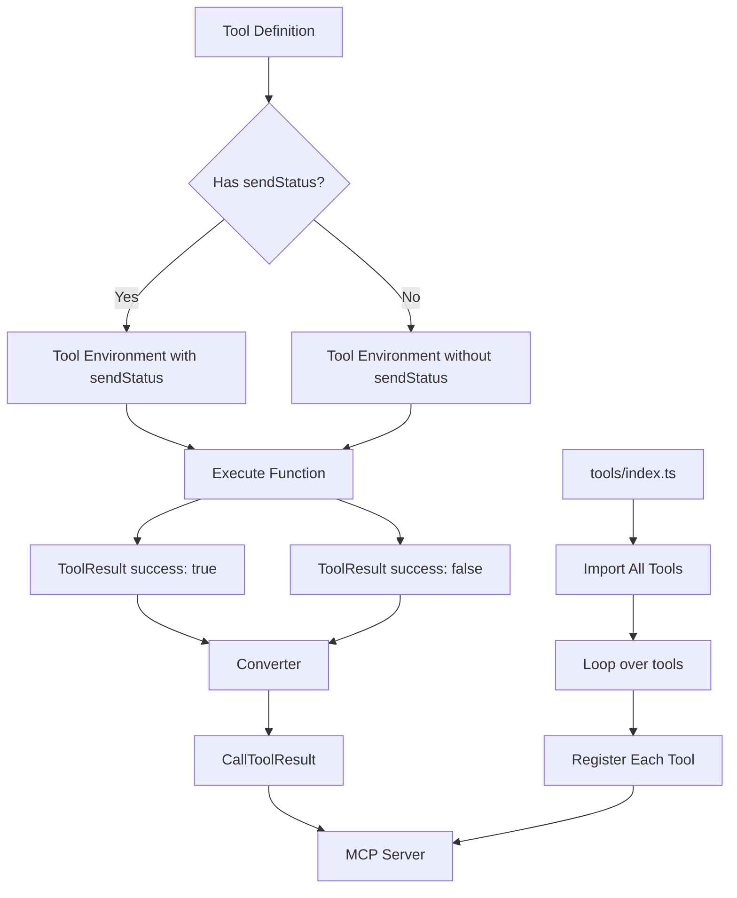

# Tool Refactoring Plan

## Overview

Refactor the MCP Ethereum server to use a new tool format where tools are objects with `execute`, `schema`, and `description` fields, returning plain JSON objects instead of `CallToolResult` types.

## Design Decisions

Based on user requirements:
1. **Error Handling**: Tools return explicit error objects like `{success: false, error: string}`
2. **Tool Organization**: Move to `src/tools/` directory with one file per tool (snake_case filenames)
3. **Return Format**: Preserve exact same format for backward compatibility with existing tests
4. **Tool Names**: Use function names as tool names (snake_case)
5. **Description**: Separate field in Tool type, not in schema
6. **ToolResult**: Explicit `success: true` for success cases

## Current Architecture

**Tool Registration:**
```typescript
server.registerTool(
  'tool_name',
  {description, inputSchema},
  async (params, extra): Promise<CallToolResult> => {
    return {
      content: [{type: 'text', text: stringifyWithBigInt(data, 2)}],
      isError: false
    };
  }
);
```

**Current Issues:**
- Every handler manually constructs `CallToolResult`
- Repetitive `stringifyWithBigInt` wrapping
- Status updates require inline `sendStatus` function creation
- Mixed concerns: business logic + MCP protocol handling

## Desired Architecture

**New Tool Type:**
```typescript
import {z} from 'zod';

type Tool<S extends z.ZodObject<any>> = {
  execute: (env: ToolEnvironment, params: z.infer<S>) => Promise<ToolResult>;
  schema: S;
  description: string;
};

type ToolEnvironment = {
  sendStatus?: (message: string) => Promise<void>;
  publicClient: PublicClient;
  walletClient?: WalletClient;
};

type ToolResult =
  | {success: true, result: Record<string, any>}
  | {success: false, error: string, stack?: string};
```


**Tool Export Pattern:**
```typescript
// src/tools/get_balance.ts
import {z} from 'zod';
import type {Tool, ToolEnvironment, ToolResult} from '../types.js';

export const get_balance: Tool = {
  description: 'Get ETH balance for an address',
  schema: z.object({
    address: z.string().describe('Address to check balance'),
    blockTag: z.union([...]).optional().describe('Block tag'),
  }),
  execute: async (env, {address, blockTag}) => {
    const balance = await env.publicClient.getBalance({
      address: address as `0x${string}`,
      blockTag,
    });

    return {
      success: true,
      result: {
        address,
        blockTag,
        balance: balance.toString(),
        balanceInEther: Number(balance) / 1e18,
      },
    };
  },
};
```

**Tool Index:**
```typescript
// src/tools/index.ts
export {get_balance} from './get_balance.js';
export {get_block} from './get_block.js';
// ... all other tools
```

**Automatic Registration:**
```typescript
// src/index.ts
import * as tools from './tools/index.js';

// Register all tools in a loop
for (const [name, tool] of Object.entries(tools)) {
  registerTool(server, name, tool);
}
```

## Architecture Diagram



## Implementation Steps

### Phase 1: Type System Design

1. **Create type definitions** in `src/types.ts`:
   - `ToolEnvironment` - interface for tool execution context
   - `Tool<P>` - generic tool type with execute, schema, and description
   - `ToolResult` - union type for success/error results with explicit success field
   - `ToolHandler<T>` - helper type for execute functions

2. **Create converter function** in `src/helpers.ts`:
   - `convertToCallToolResult(result: ToolResult): CallToolResult`
   - Handles both success and error cases
   - Wraps result with `stringifyWithBigInt`
   - Sets `isError: true` for error cases

3. **Create environment builder** in `src/helpers.ts`:
   - `createToolEnvironment(server, extra, clients, withSendStatus: boolean): ToolEnvironment`
   - Creates sendStatus function when `withSendStatus` is true
   - Passes publicClient and walletClient

4. **Create registration helper** in `src/helpers.ts`:
   - `registerTool(server: McpServer, name: string, tool: Tool<S>, withSendStatus?: boolean)`
   - Wraps execute function with MCP protocol handling
   - Registers tool with server using tool.description and tool.schema

### Phase 2: Tool File Structure

Create `src/tools/` directory structure with snake_case filenames:
```
src/tools/
  ├── wait_for_transaction_confirmation.ts
  ├── send_transaction.ts
  ├── get_contract_logs.ts
  ├── get_transaction_logs.ts
  ├── get_latest_block.ts
  ├── call_contract.ts
  ├── get_balance.ts
  ├── estimate_gas.ts
  ├── get_block.ts
  ├── get_transaction.ts
  ├── get_block_number.ts
  ├── get_gas_price.ts
  ├── get_transaction_count.ts
  ├── decode_calldata.ts
  ├── encode_calldata.ts
  ├── get_chain_id.ts
  ├── get_code.ts
  ├── get_fee_history.ts
  ├── sign_message.ts
  └── get_storage_at.ts
```

### Phase 3: Tool Index

Create `src/tools/index.ts` that exports all tools.

### Phase 4: Tool Refactoring

Refactor each tool to new format. Tools fall into categories:

**Status-Enabled Tools** (receive `env.sendStatus`):
- `wait_for_transaction_confirmation`

**Simple Read-Only Tools** (no sendStatus):
- `get_latest_block`
- `get_block`
- `get_block_number`
- `get_chain_id`
- `get_balance`
- `get_code`
- `get_storage_at`
- `get_gas_price`
- `get_transaction_count`
- `get_fee_history`
- `call_contract`

**Transaction Tools** (no sendStatus):
- `send_transaction`
- `get_transaction`
- `sign_message`

**Log Query Tools** (no sendStatus):
- `get_contract_logs`
- `get_transaction_logs`

**ABI Tools** (no sendStatus):
- `decode_calldata`
- `encode_calldata`

**Gas Tools** (no sendStatus):
- `estimate_gas`

### Phase 5: Update createServer Function

Replace all manual `server.registerTool` calls with automatic registration loop using tools from `src/tools/index.ts`.

### Phase 6: Testing

Run all tests to ensure:
- All tools still work correctly
- Status updates still function
- Error handling is preserved
- Return values are properly formatted

## Benefits

1. **Separation of Concerns**: Tool logic separated from MCP protocol
2. **Type Safety**: Better type inference with generic tool types
3. **Reusability**: Tool functions can be tested independently
4. **Consistency**: All tools follow same pattern
5. **Cleaner Code**: Less boilerplate in each tool
6. **Easier Testing**: Can test execute functions directly without MCP server
7. **Auto-Registration**: New tools automatically registered via index file
8. **Explicit Success/Error**: Clear distinction between success and error cases

## Example: Before & After

### Before
```typescript
// src/index.ts
server.registerTool(
  'get_balance',
  {
    description: 'Get ETH balance for an address',
    inputSchema: {
      address: z.string().describe('Address to check balance'),
      blockTag: z.union([...]).optional().describe('Block tag'),
    },
  },
  async ({address, blockTag}, _extra): Promise<CallToolResult> => {
    try {
      const balance = await publicClient.getBalance({
        address: address as `0x${string}`,
        blockTag: blockTag as any,
      });

      return {
        content: [{type: 'text', text: stringifyWithBigInt({
          address,
          blockTag,
          balance: balance.toString(),
          balanceInEther: Number(balance) / 1e18,
        }, 2)}],
      };
    } catch (error) {
      return {
        content: [{type: 'text', text: stringifyWithBigInt({
          error: error instanceof Error ? error.message : String(error),
        }, 2)}],
        isError: true,
      };
    }
  },
);
```

### After

**Tool file `src/tools/get_balance.ts`:**
```typescript
import {z} from 'zod';
import type {Tool, ToolEnvironment, ToolResult} from '../types.js';

export const get_balance: Tool = {
  description: 'Get ETH balance for an address',
  schema: z.object({
    address: z.string().describe('Address to check balance'),
    blockTag: z.union([...]).optional().describe('Block tag'),
  }),
  execute: async (env, {address, blockTag}) => {
    const balance = await env.publicClient.getBalance({
      address: address as `0x${string}`,
      blockTag,
    });

    return {
      success: true,
      result: {
        address,
        blockTag,
        balance: balance.toString(),
        balanceInEther: Number(balance) / 1e18,
      },
    };
  },
};
```

**Index file `src/tools/index.ts`:**
```typescript
export {get_balance} from './get_balance.js';
// ... other exports
```

**Registration in `src/index.ts`:**
```typescript
import * as tools from './tools/index.js';

// Register all tools in a loop
for (const [name, tool] of Object.entries(tools)) {
  registerTool(server, name, tool);
}
```

## Status-Enabled Tool Example

**Tool file `src/tools/wait_for_transaction_confirmation.ts` (Direct Pattern):**
```typescript
import {z} from 'zod';
import type {Tool, ToolEnvironment, ToolResult} from '../types.js';

export const wait_for_transaction_confirmation: Tool = {
  description: 'Wait For Transaction Confirmation',
  schema: z.object({
    txHash: z.string().regex(/^0x[a-fA-F0-9]{64}$/).describe('Transaction hash to monitor'),
    expectedConformations: z.number().describe('Number of confirmations to wait for').default(1),
    interval: z.number().describe('Interval in seconds between status checks').default(1),
    timeout: z.number().describe('Timeout in seconds').default(300),
  }),
  execute: async (env, {txHash, expectedConformations, interval, timeout}) => {
    // env.sendStatus is available here
    await env?.sendStatus?.(`Waiting for transaction ${txHash}...`);

    const sleep = (ms: number) => new Promise((resolve) => setTimeout(resolve, ms));

    // ... implementation ...

    return {
      success: true,
      result: {
        status: 'confirmed',
        txHash,
        confirmations,
      },
    };
  },
};
```

**Registration with sendStatus enabled:**
```typescript
registerTool(server, 'wait_for_transaction_confirmation', wait_for_transaction_confirmation, true);
```

## Implementation Notes

1. **Snake_case naming**: All tool file names and export names must be snake_case
2. **withSendStatus flag**: Tools that need sendStatus will be registered with `true` flag
3. **Preserve return format**: All tools must return the exact same data structure as before
4. **Type safety**: Use TypeScript generics to infer parameter types from schema
5. **Error handling**: Always return `{success: false, error: string}` for errors